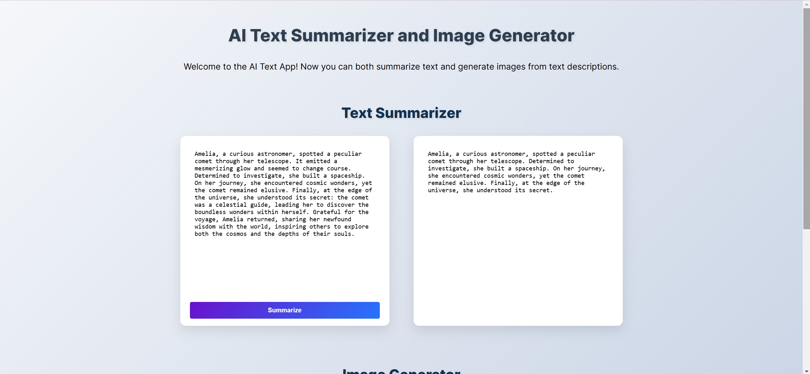
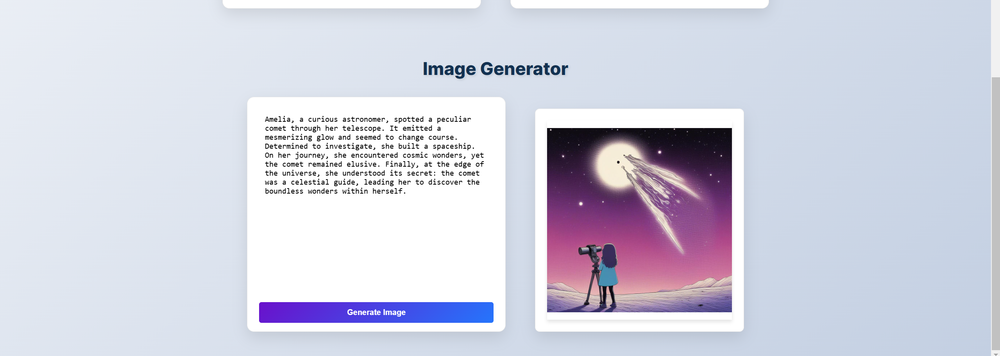

# PostmanAPI

## AI Text Summarizer and Image Generator  

1. **Text Summarization**  
   Enter a large block of text (min. 200 characters) and click the "Summarize" button to generate a concise summary.



2. **Text-to-Image Generation**  
   Enter a text description of the image you want, and click the "Generate Image" button to generate an image.




This is a full-stack web application built with **Node.js** and **Express.js** that demonstrates the power of AI by integrating two APIs:  
- **Text Summarization** using [Hugging Face's BART Large CNN model](https://api-inference.huggingface.co/models/facebook/bart-large-cnn).  
- **Text-to-Image Generation** using [Hugging Face's Text-to-Image API](https://api-inference.huggingface.co/models/ZB-Tech/text-to-image).  

The application provides a user-friendly interface to summarize large blocks of text and generate images based on text descriptions.

---

## Table of Contents  
1. [Features](#features)  
2. [Technologies Used](#technologies-used)  
3. [File Breakdown](#file-breakdown)  
4. [Setup Instructions](#setup-instructions)  
5. [How to Use](#how-to-use)  
6. [Project Flow](#project-flow)  
7. [Acknowledgments](#acknowledgments)  

---

## Features  
1. **AI Text Summarization**  
   - Input: Large text blocks (min. 200 characters).  
   - Output: A concise summary generated using the **BART Large CNN model**.  

2. **Text-to-Image Generation**  
   - Input: Text describing an image.  
   - Output: An AI-generated image in PNG format.  

3. **Environment Configuration**  
   - API keys are hidden using `dotenv`.  
   - Users can either create a `.env` file or directly replace the `ACCESS_TOKEN` in the code.

4. **Responsive Design**  
   - Clean, user-friendly interface styled with CSS.  

5. **Cross-Origin Request Handling**  
   - Enabled using the `CORS` library for smooth client-server communication.

---

## Technologies Used  
### Frontend:  
- **HTML, CSS, JavaScript** for UI and interactivity.  

### Backend:  
- **Node.js and Express.js** for server-side logic and routing.  

### APIs:  
- **Text Summarization API**: Hugging Face's BART Large CNN model.  
- **Image Generation API**: Hugging Face's Text-to-Image model.  

### Libraries:  
- **Axios**: For making HTTP requests.  
- **dotenv**: For securely handling API keys.  
- **CORS**: For enabling cross-origin requests.

---

## File Breakdown  

### `index.html`:  
- **Text Summarization Section**: Input textarea and summarize button.  
- **Image Generation Section**: Input textarea and generate image button.  
- Links to `stylesheet.css` and `script.js`.  

### `index.js`:  
- Configures middleware (`CORS`, `express.json`, `express.static`).  
- Defines two API routes:  
  - `/summarize`: Handles text summarization requests.  
  - `/convert-to-image`: Handles text-to-image conversion requests.  

### `summarize.js`:  
- Implements the logic for calling the **Text Summarization API**.  
- Validates input and uses the `ACCESS_TOKEN` for authorization.  

### `convert.js`:  
- Implements the logic for calling the **Text-to-Image API**.  
- Dynamically calculates image size based on text length.  

### `script.js`:  
- Adds interactivity to the web page (button click handling, API requests, error management).  

### `stylesheet.css`:  
- Styles the app with a clean and responsive design.  

---

## Setup Instructions  

1. **Clone the Repository**:  
   ```bash
   git clone https://github.com/medss19/PostmanAPI.git
   cd PostmanAPI
   ```

2. **Install Dependencies**:  
   ```bash
   npm install
   ```

3. **Set Up Environment Variables**:  
   - Create a `.env` file in the project root directory.  
   - Add your Hugging Face API token:  
     ```env
     ACCESS_TOKEN=your_huggingface_api_key
     ```

4. **Run the Application**:  
   ```bash
   node index.js
   ```
   - The app will start on **[localhost:3000](http://localhost:3000)**.

---

## How to Use  

1. **Text Summarization**:  
   - Enter a large block of text (min. 200 characters).  
   - Click the "Summarize" button to generate a concise summary.  

2. **Text-to-Image Generation**:  
   - Enter a text description of the image you want.  
   - Click the "Generate Image" button to see the AI-generated image.

---

## Project Flow  

1. **User Interaction**:  
   - Users interact with the web interface via the browser.  

2. **Client-Side Processing**:  
   - `script.js` validates inputs and sends API requests to the server.  

3. **Server-Side Processing**:  
   - `index.js` handles requests and routes them to the appropriate module (`summarize.js` or `convert.js`).  

4. **API Interaction**:  
   - Hugging Face APIs process the data and return results.  

5. **Result Display**:  
   - Summaries and images are displayed in the browser.

---

## Acknowledgments  
- **Hugging Face APIs**: For providing powerful AI models for text summarization and image generation.  
- **Postman Academy**: For student programs that inspired this project.  

